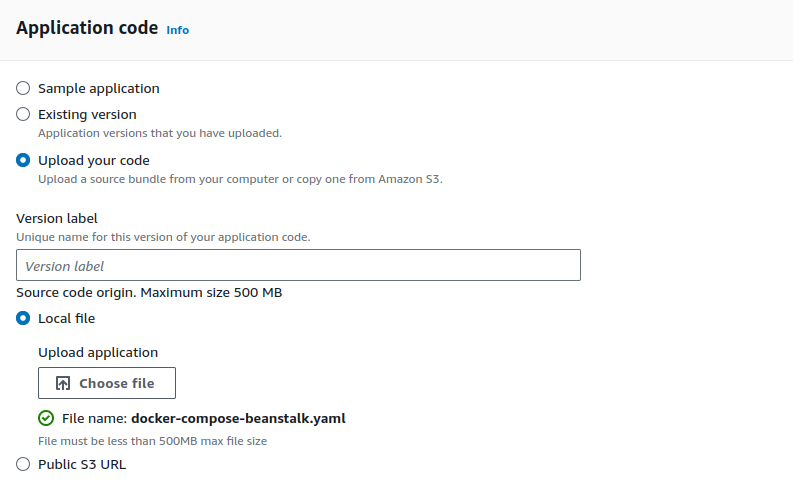

## Projekt 2
Do projektu drugiego zostały wykorzystane obrazy (docker images) z projektu pierwszego podobnie jak baza danych RDS.

ELastic Beanstalk umożliwia załadowanie tylko jednego pliku (.yaml), tym samym zmienne środowiskowe musiały zostać wylistowane w tym pliku. Tym samym nasz plik [docker-compose-file](docker-compose.yaml) musi zostać uzupełniony odpowiedniemi wartościami zmiennych środowiskowych. 

###Tworzenie środowiska Elastic Beanstalk
Dla docker-compose wybieramy platformę dokera

Następnie w kolejnej dodajemy nasz plik z dockerem

##Stworzone środowisko Beanstalkg evn:

##Stworzona instancja EC2 przez Elastic Beanstalk

Strona naszej aplikacji może zostać otworzona za wykorzystaniem linku naszej domeny utworzonej na Elastic Beanstalk.
